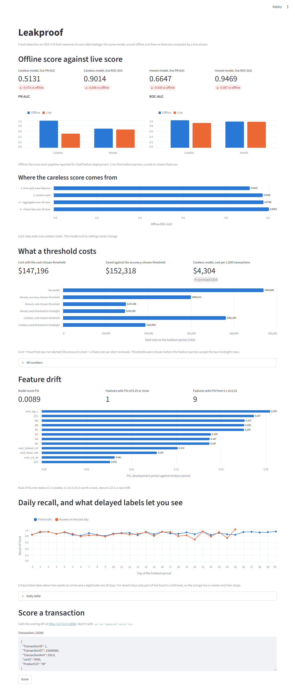

# Leakproof

Real-time fraud detection that measures its own data leakage.

A fraud model usually looks better in a notebook than it does in production. This project builds
the same LightGBM model twice on the IEEE-CIS dataset, once carelessly and once with
point-in-time-correct features, then scores both on features computed by a live stream and
reports the gap.



## Results

All numbers are on the holdout period: the last 15% of transactions by time (88,581 rows,
30.8 days), which no model or threshold saw. They are produced by the commands below and stored
in [`results/`](results).

### Offline score against live score

| Model | Offline ROC-AUC | Live ROC-AUC | Offline PR-AUC | Live PR-AUC |
|---|---|---|---|---|
| Careless | 0.999 | 0.901 | 0.986 | 0.513 |
| Honest | 0.954 | 0.947 | 0.695 | 0.665 |

- **Careless:** random split, card aggregates and card fraud rate computed over every row.
- **Honest:** time split, features built only from earlier transactions and from labels that had
  arrived, trained only on rows whose label had arrived by the training date.
- **Offline** is the score each pipeline reported for itself before deployment. **Live** is the
  holdout period scored on stream features.

### Where the careless score comes from

One careless habit is added at each step. The model and its settings never change.

| Step | Offline ROC-AUC | Offline PR-AUC |
|---|---|---|
| Time split, base features | 0.910 | 0.535 |
| Random split | 0.970 | 0.841 |
| + card aggregates over all rows | 0.974 | 0.857 |
| + card fraud rate over all rows | 0.999 | 0.986 |

A second, subtler leak is label timing. With point-in-time features but labels assumed known one
second after each transaction, the validation ROC-AUC is 0.981. With the simulated label delay
it is 0.954.

### Training-serving parity

The offline features (DuckDB window functions) and the online features (Redis, fed by Redpanda)
come from one spec. Streaming the whole holdout period through the real containers:

| | |
|---|---|
| Transactions compared | 88,581 |
| Rows with any mismatch, across 14 features | 0 |
| Largest difference | 1.8e-12 |

### What a threshold costs

Cost = fraud that was not alerted (the amount is lost) + $5 per alert reviewed. Each threshold was
chosen on data available before the holdout period.

| Policy | Alert rate | Recall | Total cost | Promised per 1k tx | Actual per 1k tx |
|---|---|---|---|---|---|
| No model | 0% | 0% | $469,609 | | $5,302 |
| Honest, accuracy-chosen threshold | 2.2% | 51% | $299,514 | $4,208 | $3,381 |
| Honest, cost-chosen threshold | 17.4% | 88% | $147,196 | $1,654 | $1,662 |
| Honest, best threshold in hindsight | 23.4% | 92% | $145,328 | | $1,641 |
| Careless, cost-chosen threshold | 1.3% | 25% | $381,244 | $264 | $4,304 |
| Careless, best threshold in hindsight | 19.8% | 82% | $192,984 | | $2,179 |

### Serving and monitoring

- **Latency:** `POST /score` over HTTP against Redis, 5,000 holdout transactions, one client:
  p50 2.8 ms, p95 4.3 ms, p99 5.9 ms server-side. Scores are identical to the batch scores.
- **Drift (PSI, development against holdout):** model score 0.009. Of 67 features, 57 are stable,
  9 are between 0.1 and 0.25, and 1 is above 0.25 (`card_age_s`).
- **Delayed labels:** on the last holdout day only 5% of holdout labels have arrived. Precision
  can't be computed for recent days. Recall among fraud confirmed so far can.

## How it works

```
                      feature spec (features/spec.py)
                       /                          \
   offline: DuckDB window functions        online: Redis sorted sets + counters
            |                                      ^
   train / validate (LightGBM)        Redpanda: one ordered stream of
            |                         transactions and label arrivals
            v                                      |
       saved model  ----------------->  FastAPI /score: read, score, record
```

- **Time split.** Train is the first 70% of transactions, valid the next 15%, holdout the last 15%.
- **Label delay.** The dataset has no chargeback dates, so they are simulated: fraud is confirmed
  after a lognormal delay (median 14 days), and a transaction counts as legitimate after 30 days.
- **Point-in-time rule.** A feature for a transaction at time `t` uses the card's transactions up
  to `t - 1` second and labels that arrived by `t`. A test moves future rows and checks that no
  past feature changes.
- **One stream.** Transactions and label arrivals share a single-partition topic, so their order
  is a property of the data and the online features are reproducible.

Design decisions are in [`docs/adr/`](docs/adr). The narrative is in [`STORY.md`](STORY.md).

## Run it

Needs [uv](https://docs.astral.sh/uv/) and Docker. The dataset (about 700 MB) downloads through
`kagglehub`.

```bash
uv sync
docker compose up -d                 # Redpanda and Redis

uv run leakproof data download
uv run leakproof data build          # time split and label delay
uv run leakproof run naive           # the leakage ladder
uv run leakproof run honest          # point-in-time features
uv run leakproof stream parity       # stream the holdout period, compare online with offline
uv run leakproof run headline        # train both final models, offline against live
uv run leakproof run decisions       # thresholds, drift, daily report
uv run leakproof serve replay        # latency over HTTP

uv run streamlit run ui/app.py       # dashboard (reads results/, needs nothing else)
uv run leakproof serve run           # scoring API on :8000
```

Tests, lint and types need neither Docker nor the dataset:

```bash
uv run pytest && uv run ruff check . && uv run mypy src
```

## Limits

- **The label delay is simulated**, and independently of everything else. In real data, fraud that
  is confirmed quickly may differ from fraud confirmed late.
- **The "live" careless score is one reading** of how its features would be served: from the
  card's history so far and from labels that have arrived.
- **`card_id` is an approximation** of an account, built from card fields and the first-seen day.
- **The cost model is simple:** a $5 review cost (configurable), every reviewed fraud is stopped,
  and a false alarm costs only the review.
- **Latency was measured with one client on a laptop.** It says nothing about concurrent load.
- **The consumer is single-threaded on one partition** (about 900 events per second here).
- **One dataset, one seed.** No confidence intervals are reported.

## Data

[IEEE-CIS Fraud Detection](https://www.kaggle.com/c/ieee-fraud-detection) (Vesta Corporation).
The data is not in this repository, and the competition's terms apply to it.
